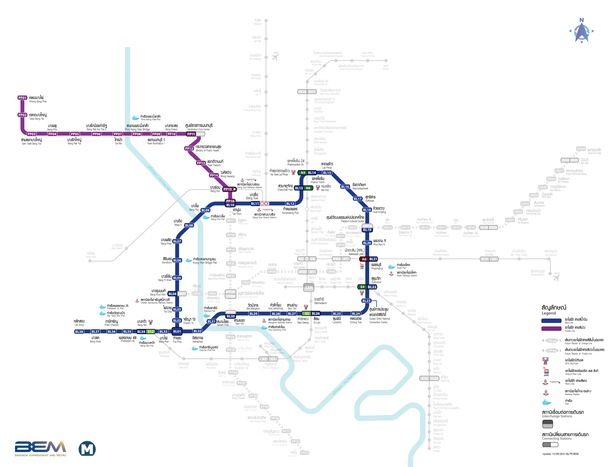

# MRT Assistance (CS50P Project)

### Video Demo: 
URL: https://youtu.be/UFYqHnPju3M 

### Description 

The MRT Blue Line is Bangkok's third rapid transit line, managed by Bangkok Expressway and Metro (BEM). It stretches for 48 kilometers and includes 38 stations, making it easy for people to get to important places in the city. The MRT Blue Line has greatly improved Bangkok's public transportation system, making it easier for people to move around and reducing the problem of too much traffic on the roads.

The "MRT Assistance" project idea came to me while I was using the BTS to visit a department store. I realized that I wanted to work on a project related to either MRT or BTS. Considering how frequently I use the MRT compared to BTS, I decided to focus on the MRT. I aim to create a project with both useful features and creative ideas. I'll demonstrate it using a console, showing various functions that represent how the MRT system works. 

Here's the list of functions:

| Number | Function | Description |
|---|---|---|
| 1 | Create New Person | Add new people to the system with their details. This function will auto generate the national id of people with 13 digits. |
| 2 | Show All Person | See a list of all people in the MRT system. |
| 3 | Show All MRT Cards | Display a list of all the MRT cards. |
| 4 | Create MRT Card | Generate a new MRT card by providing the person's details. When generating the card, you pay `150` baht, which covers the card cost of 100 baht and adds 50 baht for travel. This function will auto generate the card number of MRT card with 8 digits. |
| 5 | Top Up Money | Add money to an MRT card. You must add a minimum of `100` baht.|
| 6 | Process Payment | Pay for MRT rides using the money on an MRT card. |
| 7 | MRT Calculator | Calculate the fare for a specific MRT trip. |

### Bangkok MRT Blue Line MAP

| Station Number | Station Name |
|---|---|
| 38  | Lak Song     |
| 37  | Bang Khae    |
| 36  | Phasi Charoen|
| 35  | Phetkasem 48 |
| 34  | Bang Wa      |
| 33  | Bang Phai    |
| 1   | Tha Phra     |
| 2   | Fai Chai     |
| 3   | Charun Sanitwong Railway Station |
| 4   | Bang Khun Non|
| 5   | Bang Yi Khan |
| 6   | Sirindhorn   |
| 7   | Bang Phlat   |
| 8   | Bang O       |
| 9   | Bang Pho     |
| 10  | Tao Poon     |
| 11  | Bang Sue     |
| 12  | Kamphaeng Phet |
| 13  | Chatuchak Park |
| 14  | Phahon Yothin  |
| 15  | Lat Phrao      |
| 16  | Ratchadaphisek |
| 17  | Sutthisan      |
| 18  | Huai Khwang    |
| 19  | Thailand Cultural Centre|
| 20  | Phra Ram 9  |
| 21  | Phetchaburi |
| 22  | Sukhumvit   |
| 23  | Queen Sirikit National Convention Centre |
| 24  | Klong Toei   |
| 25  | Lumphini     |
| 26  | Silom        |
| 27  | Sam Yan      |
| 28  | Hua Lamphong |
| 29  | Wat Mangkon  |
| 30  | Sam Yot      |
| 31  | Sanam Chai   |
| 32  | Itsarahap    |

### MRT Card Type 

1. `Adult Card`
- For general public
- Fare is calculated at the **regular rate**.

2. `Student Card`
- For students under 23 years old
- Get a **10% discount** on regular fare for all travel trips.
3. `Elder Card`

- For individuals aged 60 years and older.
- Get a **50% discount** on regular fare for all travel 

### MRT Blue Line Fare

| Number of Station | Fare (baht) |
|---|---|
| 0 | 16 | 
| 1 | 16 | 
| 2 | 23 | 
| 3 | 26 | 
| 4 | 30 | 
| 5 | 33 | 
| 6 | 37 | 
| 7 | 40 | 
| 8 | 44 | 
| 9 | 44 | 
| 10 | 44 |  
| 11 | 44 | 
| 12 | 44 | 
| 13+ | 44 | 

